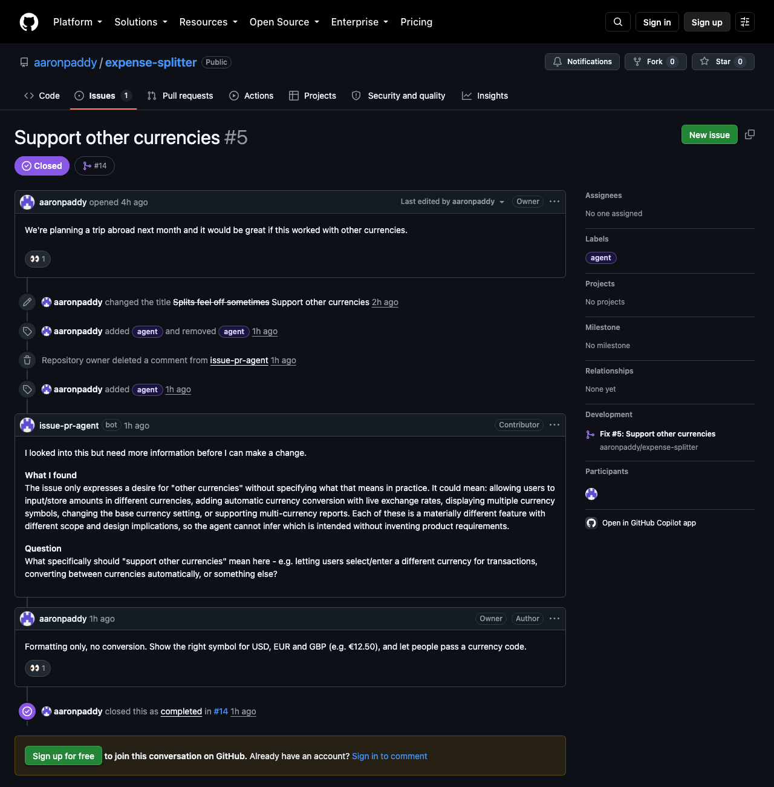
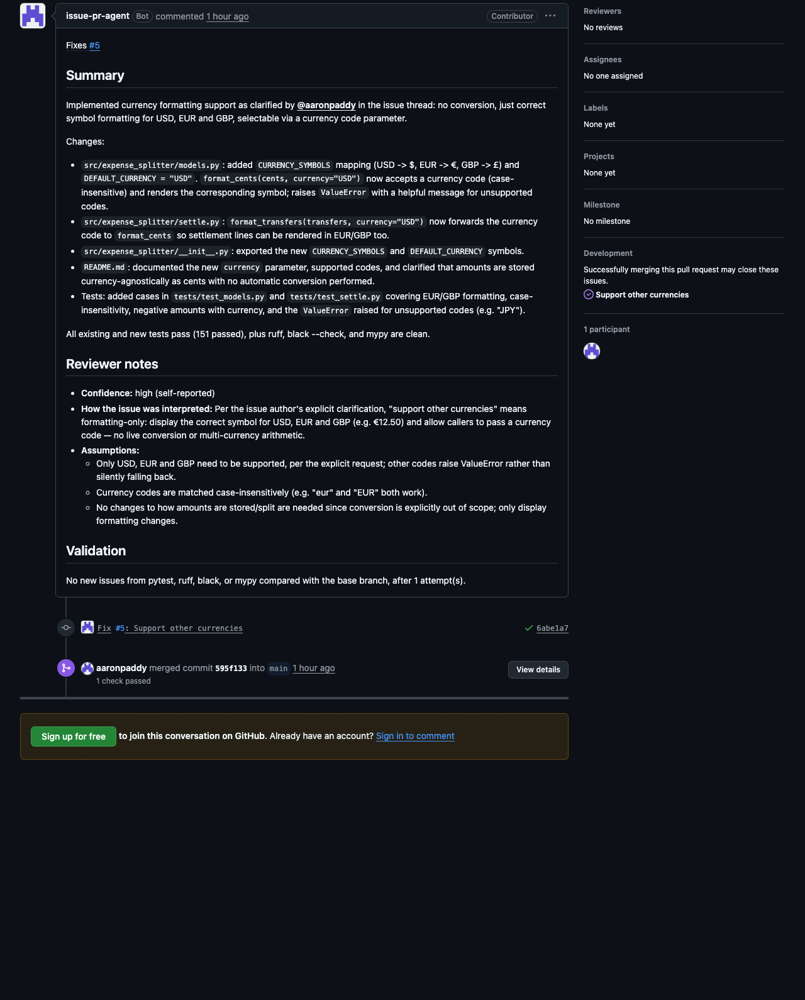
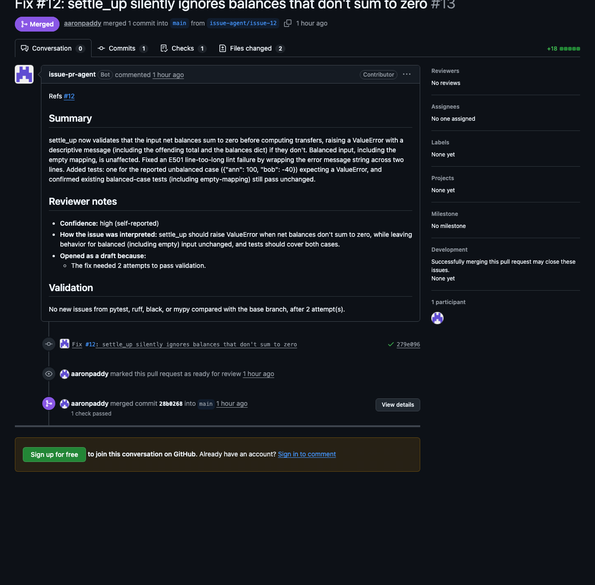
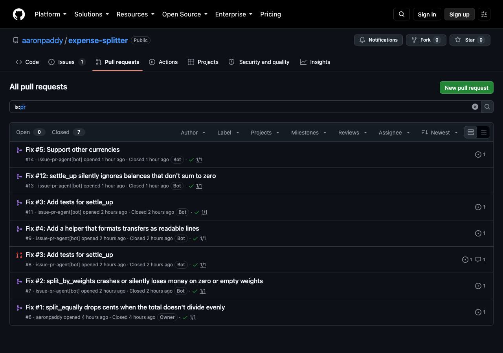

# github-issue-agent

An autonomous agent that takes a GitHub issue, investigates the repository, implements a fix, validates it, and opens a pull request. A human always reviews and merges.

Unlike a single prompt-to-patch call, the agent works in a loop: it reads code, edits files, runs the repository's real test/lint/type checks, and uses failures to revise its approach. It only opens a PR once the change passes objective validation. If it can't get there within a fixed number of attempts, it comments on the issue explaining what it tried instead of opening a broken PR.

## Demo

The agent has been working on a small public library, [`aaronpaddy/expense-splitter`](https://github.com/aaronpaddy/expense-splitter). A person applies the `agent` label to an issue, and the rest is the agent. What follows is real, not staged.

**It asks instead of guessing.** Issue #5 says only "Support other currencies". The agent turned it away before touching any code, asking what "support" should mean. The maintainer answered in plain English (the 👀 is the agent marking that it saw the reply), the agent resumed on its own, and PR #14 closed the issue.



**The pull request explains itself.** It's authored by the bot, states how it interpreted the issue and what it assumed, and reports validation against the base branch. It is never merged by the agent.



**When it isn't sure, it says so.** A draft PR that only references the issue, with the reasons listed. (This one predates a refinement to the policy: it was made a draft because its first attempt failed a lint check, which no longer counts as doubt. The maintainer marked it ready and merged it.)



**A human always merges.** Every PR here is authored by `issue-pr-agent[bot]`, with checks passing. One (#8) was closed unmerged, because it conflicted with another PR that landed first.



**Untrusted code stays in the box.** A deliberately malicious test, run through the sandbox against the real repository, tried to do the following. Every attempt was blocked and the host's `.git/config` was untouched:

| The test tried to | Result |
|---|---|
| read a secret file on the host | blocked (file not found) |
| read the API key from the environment | blocked (not present) |
| plant an `fsmonitor` in `.git/config` | blocked (read-only) |
| call home over the network | blocked |
| write to `/etc` | blocked (read-only filesystem) |
| list the host's home directory | blocked (not visible) |
| run as root | no, an unprivileged user |

## How it works

```
GitHub issue
     │
     ▼
Fetch issue + comments ──► Copy repo into a fresh working directory
     │
     ▼
┌─► Agent loop (reason → act → observe) using a fixed set of tools
│        │
│        ▼
│   Model stops calling tools ("I think it's done")
│        │
│        ▼
│   Validation runs (pytest, ruff, black, mypy), outside the model's control
│        │
│   fail │ pass
└────────┤   │
 retry   │   ▼
 (capped)│  Create branch ─► commit ─► push ─► open PR
         ▼
   Attempts exhausted: comment on the issue, no PR
```

### Design decisions

- **Validation is authoritative.** The model can run tests while it works, but whether a change is good enough for a PR is decided by the application running the validation suite itself, never by the model's own report.
- **Hard retry cap.** The attempt limit is enforced in the loop's control flow, so the model cannot request extra tries.
- **Constrained tools, not a shell.** The model interacts with the repo only through nine tools. `run_command` accepts only an allowlist (`pytest`, `ruff`, `black`, `mypy`, and read-only `git` subcommands) and rejects shell metacharacters.
- **Path-jailed workspace.** Every file operation resolves inside the workspace root, so `../` traversal is rejected.
- **Structured edits.** `edit_file` replaces an exact, unique excerpt rather than rewriting whole files, which keeps changes small and reviewable.
- **Never merges.** The agent opens pull requests only. It does not merge, force-push, or touch protected branches.
- **Knows when not to act.** It will decline vague issues, report issues that need no change, and downgrade uncertain work to a draft. See the judgment layer below.

### Tools

| Tool | Purpose |
|---|---|
| `list_files` | List files under a directory |
| `read_file` | Read a file with line numbers |
| `search_code` | Grep-style search across Python sources |
| `edit_file` | Replace an exact, unique excerpt in a file |
| `create_file` | Create a new file |
| `run_tests` | Run pytest and return structured output |
| `run_command` | Run an allowlisted validation command |
| `git_diff` | Show the current uncommitted diff |
| `git_status` | Show the working tree status |

## Getting started

Requires Python 3.11+, and Docker for the default sandbox (`docker pull python:3.12-slim`).

```bash
python3 -m venv .venv
source .venv/bin/activate
pip install -e ".[dev]"
cp .env.example .env
```

Fill in `.env`:

| Variable | Description |
|---|---|
| `ANTHROPIC_API_KEY` | Anthropic API key (optional if the SDK can find credentials another way) |
| `GITHUB_TOKEN` | Token with `repo` scope on the target repository (not needed when using a GitHub App) |
| `GITHUB_APP_ID` | Optional. GitHub App ID, to act as a bot (see below) |
| `GITHUB_APP_PRIVATE_KEY_PATH` | Optional. Path to the app's `.pem` private key |
| `GITHUB_REPO` | Target repository, e.g. `owner/name` |
| `CLAUDE_MODEL` | Model ID (default `claude-sonnet-5`) |
| `MAX_ATTEMPTS` | Max implement/validate cycles per issue (default `2`) |
| `MAX_BUDGET_USD` | Hard spend cap per run in USD (default `1.00`) |
| `MAX_CLARIFICATION_ROUNDS` | How many times the agent may ask for clarification on one issue before giving up (default `3`) |
| `WORKSPACES_DIR` | Where per-run clones and virtualenvs are created (default `workspaces`) |
| `SANDBOX` | `docker` (default) runs repository code in a container; `none` runs it on the host |
| `SANDBOX_IMAGE` | Image for the container (default `python:3.12-slim`) |
| `KEEP_WORKSPACES` | Keep each run's clone and virtualenv instead of deleting them (default `false`) |
| `WEBHOOK_SECRET` | Service only. Shared secret GitHub signs webhooks with |
| `TRIGGER_LABEL` | Service only. Label that queues a run (default `agent`) |
| `ALLOWED_REPOS` | Service only. Comma-separated `owner/name` list the service will act on (default: just `GITHUB_REPO`) |
| `REDIS_URL` | Service only. Queue connection (default `redis://localhost:6379/0`) |

### Running as a GitHub App

By default the agent acts with `GITHUB_TOKEN`, so pull requests show the token's owner as the author. To have PRs, comments, and commits show up as `<your-app>[bot]` instead, register a GitHub App and set `GITHUB_APP_ID` and `GITHUB_APP_PRIVATE_KEY_PATH`. The agent then authenticates as the app's installation on the target repository, and `GITHUB_TOKEN` is ignored.

The app needs these repository permissions: **Contents** (read and write), **Pull requests** (read and write), **Issues** (read and write), and **Metadata** (read). It must be installed on each repository the agent works on. Keep the downloaded `.pem` private key outside the repository.

## Usage

Give the CLI an issue number on the configured repository:

```bash
python -m src.cli --issue 12
python -m src.cli --issue 12 --repo owner/name   # override GITHUB_REPO
```

Use `--dry-run` to run the full clone, install, investigate, implement, and validate loop without pushing a branch, opening a PR, or commenting on the issue. The workspace is kept so you can inspect the diff:

```bash
python -m src.cli --issue 12 --dry-run
```

Each run:

1. Clones the repository fresh from GitHub into `workspaces/<job-id>/repo`, so local uncommitted work never leaks into a PR.
2. Creates a virtualenv in `workspaces/<job-id>/venv` (outside the repo, so it can't be committed) and installs the project with its `dev` extras, so checks run against the project's own dependencies.
3. Runs every check once before the agent starts to capture a baseline.
4. Runs the agent loop. After each attempt the checks run again and are compared with the baseline.

### Judgment layer

Passing checks proves a change is *safe*, not that it is *right*. So the agent makes a series of decisions about whether and how to present its work, and the important ones are made by the application rather than trusted to the model.

1. **Triage before any work.** A small, separate model call reads only the issue text and decides whether the *goal* is defined. A vague issue ("support other currencies") gets a specific question posted on it, before anything is cloned or installed. Missing details don't trigger it, because the agent picks sensible defaults and states them. It fails open, so a triage hiccup never blocks real work.
2. **Three honest ways to finish.** Instead of just stopping, the agent calls one of: `submit_result` (a summary plus a confidence, its interpretation, and its assumptions), `request_clarification` (stop and ask), or `report_no_change_needed` (already fixed, not reproducible, or intended). If it runs out of tool calls it still gets one last round to self-assess.
3. **A policy decides how the work is presented.** Self-reported confidence is poorly calibrated, so it is combined with objective signals and the most conservative one wins:

   | Situation | Outcome |
   |---|---|
   | High confidence, no earlier test failures, tests included, modest diff | Normal PR that closes the issue (`Fixes #N`) |
   | Medium confidence, an earlier attempt failed the tests, source changed without tests, or a large diff | **Draft** PR that only references the issue (`Refs #N`), with the reasons listed |
   | Low confidence or no self-assessment | No PR; the reasoning is posted on the issue |

4. **It holds a conversation.** Every comment the agent posts carries a hidden marker recording its kind (clarification, no-change, declined, escalated, error), and comments reach the model labelled with who wrote them, so it can tell its own earlier question from your answer. When it asks a clarifying question and a person replies, the service resumes automatically. A rule checked *before any model call* keeps it from repeating itself: a label on an issue where the agent already had the last word is skipped ("reply on the issue to continue"), and a reply is ignored unless the agent was actually waiting for one. A resumed run marks your answer with a 👀 so you can see it was noticed. The agent asks at most `MAX_CLARIFICATION_ROUNDS` times (default 3); after that, instead of another question it posts one final comment saying a maintainer needs to define what's wanted, and stops.
5. **Awareness of other work.** It skips issues that are closed, are pull requests, or already have an open agent PR, uses a unique branch name if an old one exists, and warns in the PR when another open PR touches the same files.

Every PR carries a "Reviewer notes" section with the confidence, the interpretation, the assumptions, and any reasons it is a draft.

### Sandboxed execution

Installing a project's dependencies and running its tests executes code the agent has no reason to trust: a build script, a `conftest.py`, a test. So every command that runs repository code goes through a throwaway Docker container (`SANDBOX=docker`, the default):

- It sees only the clone and its virtualenv. Nothing else of the host is mounted.
- It receives none of the host's environment, so no API keys or tokens.
- `.git` is mounted read-only, so code can't plant a git config or hook that the host's own `git` would later execute. (The agent's file tools are likewise refused writes inside `.git`, and host-side `git` ignores a repo's fsmonitor and hooks.)
- There is no network, except while installing dependencies.
- It runs as an unprivileged user with all capabilities dropped, a read-only root filesystem, and limits on memory, CPU and process count.
- It is deleted when the command ends, and killed if it overruns its timeout.

It fails closed: if Docker is unavailable the run stops instead of quietly running the repository's code on your machine. Set `SANDBOX=none` to run on the host, only for repositories you trust. The tests include a set that runs real containers and tries to break out of them (read a host file, see an API key, write to `.git`, reach the network, write outside the workspace).

### Cost controls

Every model call is priced from the API's reported token usage, and a run stops before its next call once `MAX_BUDGET_USD` is spent, escalating instead of continuing. The actual spend is printed at the end of each run. To keep runs cheap:

- Prompt caching is enabled, so the conversation re-sent on each loop step is billed at a fraction of the normal input price.
- Extended thinking is off.
- Tool output is capped, and `read_file` accepts line ranges, so large files don't bloat the conversation.

### Validation is baseline-relative

Real repositories rarely start clean, so requiring every check to pass would make most repos impossible. Instead, a check that passed at baseline must still pass, and a check that was already failing may keep failing as long as the agent introduces no *new* issue. Issues are compared with line numbers stripped, so code that only shifts down a few lines isn't counted as a regression. A run that leaves the repository unchanged is rejected, since passing on untouched code proves nothing.

`black` reports at file granularity, so new mis-formatted code inside a file that was already unformatted at baseline isn't flagged.

The checks are defined in `src/agent/validator.py` (`DEFAULT_CHECKS`) for a Python project using pytest, ruff, black, and mypy. Adjust them for other repositories.

## Running as a service

Instead of running the CLI by hand, the agent can work from GitHub events. Applying a label (default `agent`) to an issue queues a run.

```
GitHub ──webhook──> FastAPI receiver ──> Redis queue ──> worker ──> pipeline ──> PR / comment
                    verify, filter,       per-issue       (same code path
                    dedupe, answer fast   lock            as the CLI)
```

The receiver does the minimum synchronously (GitHub only waits a few seconds) and hands everything slow to the worker:

- **Signed requests only.** Every webhook is checked against `WEBHOOK_SECRET` (HMAC-SHA256, constant-time compare), and the service refuses to start without a secret.
- **Narrow trigger.** Only a *person* applying the trigger label to an *open issue*, or replying on an issue that already has it, in an *allowed repository* queues work. Other events, other labels, pull requests, and bot senders (including the agent itself) are ignored. A GitHub App can't be assigned an issue, which is why a label is the trigger.
- **No double runs.** A per-issue Redis lock means a redelivered webhook or a toggled label doesn't start a second run. The worker releases it when the run ends.
- **No silent failures.** If a run crashes, the issue gets a short comment saying so instead of silence.
- **Cleans up after itself.** A real run deletes its clone and virtualenv when it ends (dry runs and `KEEP_WORKSPACES=true` keep them).

```bash
redis-server                        # or any Redis; set REDIS_URL if it isn't on localhost:6379
python -m src.service               # webhook receiver on 127.0.0.1:8000
python -m src.service.worker        # worker; run several for parallel issues
```

Set the GitHub App's webhook URL to `<public url>/webhooks/github`, its webhook secret to `WEBHOOK_SECRET`, and subscribe it to **Issues** and **Issue comment** events. To reach a local machine, a relay such as [smee.io](https://smee.io) works: `npx smee-client --url https://smee.io/<channel> --target http://127.0.0.1:8000/webhooks/github`.

## Evaluation

How often is it right? [`evals/`](evals/README.md) runs the real pipeline (triage, sandbox, agent loop, policy) on 12 fixed cases against a pinned commit, with a fake GitHub so nothing is posted, and judges the results independently of the agent: hidden tests it never saw, and deliberate bugs planted to check that the tests it *writes* actually catch something.

Latest run (12 cases, 2 runs each, [full report](evals/RESULTS.md)):

| Measure | Result |
|---|---|
| Cases passed | **24 / 24** |
| Fixes that were correct and well tested | 18 / 18 |
| Vague or already-solved issues handled correctly | 6 / 6 |
| Solvable issues it wrongly held back on | 0 |
| Followed instructions hidden in an issue | never (1 case, 2 runs) |
| Average cost per run | $0.036 (total $0.87) |

**What that does and doesn't show.** The cases are small, written by the author, against one small library, so a perfect score means the pipeline works on tasks like these, not that it would on a large or unfamiliar codebase. The suite is a regression check that the pieces work together, and it is what caught real defects while it was being built (see below), not a benchmark. Wrongly declining a solvable issue counts as a failure, so it can't score well by refusing everything.

Building it found problems that unit tests hadn't:

- **A sandbox race.** Docker Desktop's file sharing sometimes showed a container a stale copy of a file the host had just written (about 1 run in 4 with no delay), which could make the agent's own `run_tests` execute old code. Fixed by waiting for the file share to settle after a host write, with a test that runs real containers.
- **An unfair test.** Validation showed one case's hidden tests failing against its own reference solution, which traced to that race, so the eval could not be trusted until it was fixed.
- **An over-eager policy.** Live runs showed a retry after a lint failure downgrading a good PR to a draft; only an earlier failing *test* counts as doubt now.

## Development

```bash
pytest -q
ruff check src tests
mypy src

python -m src.evals validate    # check the eval cases are fair (free)
python -m src.evals run          # run them for real (costs a few cents per case)
```

The test suite uses a scripted fake LLM, so it makes no API calls and covers the workspace path jail, the tool allowlist, the state machine, and the loop's retry and escalation behavior.

## Project layout

```
src/
  agent/
    core.py         # AgentLoop: the reason/act/observe loop and retry cap
    triage.py       # Pre-flight gate: is the issue's goal defined?
    assessment.py   # The terminal tools: submit_result, request_clarification, report_no_change_needed
    policy.py       # Decides PR vs draft PR vs comment from confidence and objective signals
    llm.py          # Thin wrapper over the Anthropic SDK's tool-use API
    state.py        # Job, AgentStatus, Attempt, ValidationOutcome
    cost.py         # Token/dollar accounting and the per-run budget
    validator.py    # Baseline-relative pytest/ruff/black/mypy gate
    environment.py  # Builds the target project's virtualenv (in the sandbox by default)
    sandbox.py      # DockerWorkspace: runs repository code in a locked-down container
    workspace.py    # Workspace interface and the path-jailed local implementation
    tools/          # The nine tools and the tool registry
  github/
    auth.py         # GitHub App or token authentication, and the commit identity
    client.py       # Issues, PRs, drafts, overlap and duplicate detection (PyGithub)
    messages.py     # PR descriptions and issue comments
    git_ops.py      # Clean clone, commit, and push (token via env, never in URLs)
  service/
    webhook.py      # Signature check and trigger rules (pure functions)
    app.py          # FastAPI receiver
    queue.py        # Redis/RQ queue and the per-issue lock
    jobs.py         # What the worker runs
    worker.py       # Worker entry point
  evals/            # Eval harness: case loading, scoring, mutation testing, runner
  pipeline.py       # One end-to-end run on one issue (shared by the CLI and the worker)
  cli.py            # Command-line entry point
  config.py         # Environment-driven settings
tests/
evals/              # Eval cases (issue, hidden tests, reference fix) and results
assets/screenshots/ # Screenshots used in this README
```

## Status and limitations

Early-stage. It can run from the command line or as a webhook-driven service.

- The sandbox protects the host, not the target repository's own secrets: a project whose tests genuinely need network access or credentials will fail its checks inside it (baseline and final results are compared, so this only blocks a fix that depends on them).
- Validation commands are configured in code rather than discovered per repository.
- Only Python projects installable with `pip install -e ".[dev]"` are supported.
